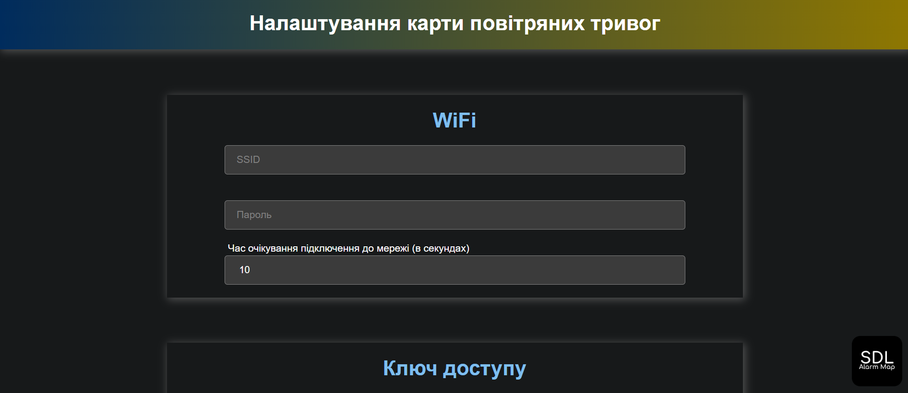

# SDL Alarm Map Premium

> Розробка проєкту завершена. Цей репозиторій зберігає код у стані липня 2024 року (версія 16.07.2024). Подальших оновлень не планується.

## Опис
**SDL Alarm Map Premium** — прошивка для карти тривог з широким функціоналом: онлайн-завантаження, декілька режимів стрічки та дисплею, керування яскравістю та інтеграція з розумним домом.

## Основні можливості

### Онлайн-завантажувач
Швидке завантаження без зусиль.  
Інструмент дозволяє прошивати карту одним кліком, без необхідності використання додаткових програм.  

### Налаштування карти
Персоналізація карти під ваші потреби через веб-інтерфейс (`alarm-map.local`):  
- Темна та світла теми з автоперемиканням  
- Кнопка для визначення Telegram ID  
- Перезавантаження та очищення карти  

### Telegram-бот
Зручне керування картою та стрічкою через Telegram:  
- Вмикання/вимикання дисплею  
- Перемикання режимів  
- Керування яскравістю  
- Перегляд температури, версії прошивки, IP-адреси  

### Режими стрічки
Доступні режими відображення:  
- Тривоги (всі регіони)  
- Тривога в обраному регіоні  
- Прапор України  
- Ліхтарик

### Автоматичне регулювання яскравості
- За розкладом (зазначення рівня та часу)  
- За допомогою фоторезистора (з можливістю калібрування)  

### Дисплей: інформаційні режими
- Час, дата  
- Температура та вологість (DHT)  
- Погода  
- Інформація про тривогу  
- Дані про війну  
- Курс валют  

### Звукові оповіщення
Підтримка активного бузера або динаміка для звукового оповіщення про тривоги.

У папці [`assets/sounds`](./assets/sounds/) доступно **три готові набори звуків** для динаміка (по два файли у кожному наборі):
- `0001.mp3` — оголошення тривоги  
- `0002.mp3` — відбій тривоги

### Інтеграція з розумним домом
Інтеграція через [**Sinric Pro**](https://sinric.pro/) (Amazon Alexa, Google Home, SmartThings, Homebridge).  
Можливості:  
- Керування стрічкою (вкл/викл, яскравість)  
- Перегляд температури  

### Підтримувані дисплеї
- OLED I2C 128x32 SSD1306
- OLED I2C 128x64 SSD1306
- OLED SPI 128x32 SSD1306
- OLED SPI 128x64 SSD1306

### Джерела даних
- API Клименко Вадим — [`vadimklimenko.com`](https://vadimklimenko.com/map/)  
- Ubilling — [`ubilling.net.ua/aerialalerts`](https://wiki.ubilling.net.ua/doku.php?id=aerialalertsapi)
- Офіційне API — [`ukrainealarm.com`](https://map.ukrainealarm.com/) (потрібен токен)  
- Сервер JAAM — [`alerts.net.ua`](https://jaam.net.ua/)

## Посилання
- [Інструкція користувача](./docs/manual.pdf)
- [Трейлер](./assets/video/trailer.mp4)

## Подяки
Дякую всім, хто користувався SDL Alarm Map Premium, тестував та допомагав вдосконалювати проєкт.