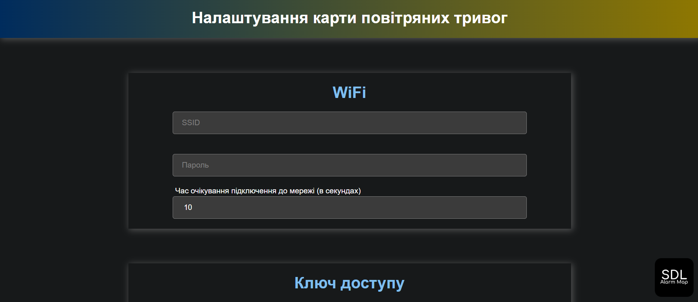
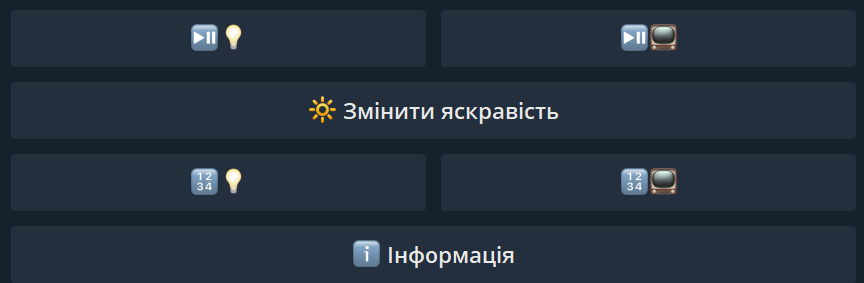
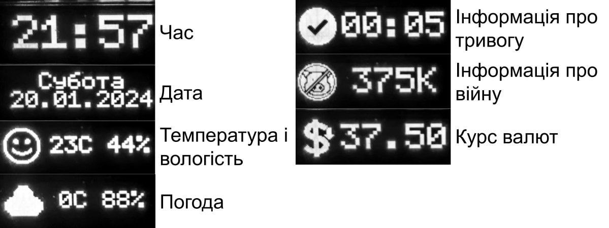

# SDL Alarm Map Premium

> The project development is completed. This repository preserves the code as of July 16, 2024 (version 1.3.1). No further updates are planned, so failures and bugs may occur and will not be fixed. Provided for reference, development, and creating your own solutions.

## Description
**SDL Alarm Map Premium** — firmware for an alarm map with extensive functionality: online flashing, multiple strip and display modes, brightness control, and smart home integration.

## Key Features

### Online Flasher
Fast flashing without hassle.
The tool allows you to flash the map with a single click, without needing additional software.

### Map Settings
Customize the map to your needs through the web interface (`alarm-map.local`):  
- Dark and light themes with auto-switching
- Button for detecting Telegram ID
- Restarting and resetting the map 

### Telegram Bot
Convenient control of the map and LED strip via Telegram:
- Turning the display on/off
- Switching modes
- Brightness control
- Viewing temperature, firmware version, IP address

### LED Strip Modes
Available display modes:
- Alarms (all regions)
- Alarm in the selected region
- Flag of Ukraine
- Flashlight

### Automatic Brightness Adjustment
- By schedule (set level and time)
- With photoresistor (calibration available) 

### Display: Information Modes
- Time, date
- Temperature and humidity (DHT)
- Weather
- Alarm information
- War data
- Exchange rates

### Sound Alerts
Support for an active buzzer or speaker for audible alarm notifications.

In the [`assets/sounds`](./assets/sounds/) folder, **ready-made sound sets** are available for the speaker (two files per set):
- `0001.mp3` — alarm start
- `0002.mp3` — alarm end

### Smart Home Integration
Integration via [**Sinric Pro**](https://sinric.pro/) (Amazon Alexa, Google Home, SmartThings, Homebridge).  
Features:
- Control of the LED strip (on/off, brightness) 
- Temperature monitoring

### Supported Displays
- OLED I2C 128x32 SSD1306
- OLED I2C 128x64 SSD1306
- OLED SPI 128x32 SSD1306
- OLED SPI 128x64 SSD1306

### Data Sources
- API by Vadym Klymenko — [`vadimklimenko.com`](https://vadimklimenko.com/map/)  
- Ubilling — [`ubilling.net.ua/aerialalerts`](https://wiki.ubilling.net.ua/doku.php?id=aerialalertsapi)
- Official API — [`ukrainealarm.com`](https://map.ukrainealarm.com/) (token required)
- JAAM Server — [`alerts.net.ua`](https://jaam.net.ua/)

## Links
- [User Manual](./docs/manual.pdf)
- [Build Scheme](./docs/scheme.pdf)
- [Trailer](./assets/video/trailer.mp4)

## Acknowledgments
Thanks to everyone who used SDL Alarm Map Premium, tested it, and helped improve the project.